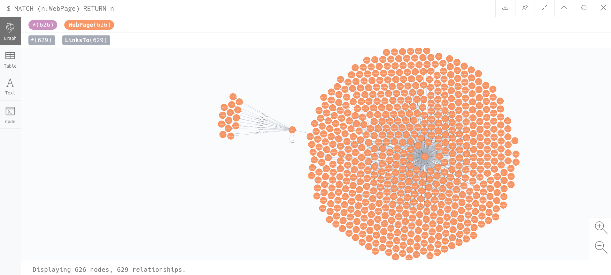
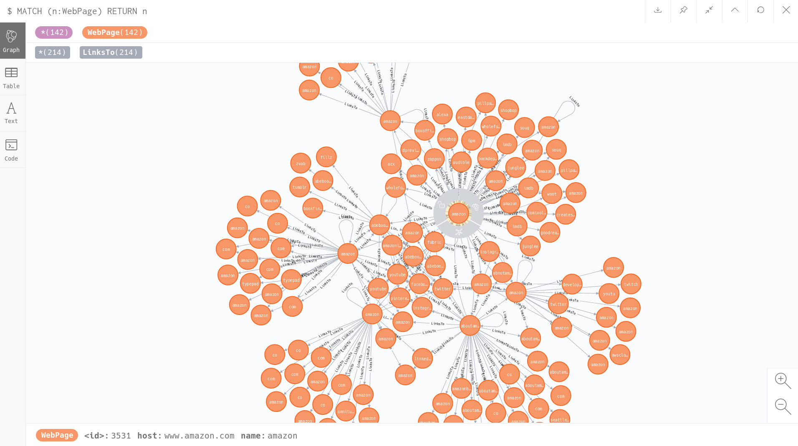

# webGraph
**webGraph** analyzes recursively a web page and creates a graph map showing how it connects with other web pages.

This project is fully **async**. It is built using [Trio](https://github.com/python-trio/trio). 

These are system's main components: 
* *Donwloader*: downloads the web pages' HTMLs.
* *Crawler*: analyzes the html and extracts, filters, and tramsforms urls that links to.
* *Dumper*: dumps the analyzed web page and the urls links them to, in a graph database. After dumping data, it also analyezes the urls in order to send it to *Downloader* for downloading it.

These three parts are independent, they execute in separate coroutines. This gives the flexibility to adjust different number of workers for each component. For example, there can be 4 *Downloaders*, 1 *Crawler* and 2 *Dumpers*.

webGraph uses a **MapReduce** model. *Downloader* executes mapping and *Crawler* reduces it. The three components are connected by queues in a circular architecture. The messages flow between them follows this order: *Downloader*-*Crawler*-*Dumper*-*Downloader*...

## Dependencies
Python requirements are specied in *requirements.txt*.

There are two python-external depenedencies:
1. [Neo4j](https://neo4j.com/download/)

1. [Redis](https://redis.io/download)

* Apart from installing and starting Neo4j and Redis, you also need to add the following environment variables to python:
    * NEO4J_USER=
    * NEO4J_PASSWORD=
    * NEO4J_URL=
    * REDIS_URL=
    * REDIS_PORT=
    
This databases can be swapped by any other graph database and/or a set database. Inside *webGraph/utils/_abc.py* there are the database abstract classes. So in order to swap a database, you only need to implement those abstract classes.
## Usage

This is the way to analyze a web page using **webGraph**:
```bash
python -m webGraph.start_web_graph {web page} 
```
or
```bash
python -m webGraph.start_web_graph {web page} {downloaders amount} {crawler amount} {dumpers amount}
```
If you do not specify the amounts, it is the same as doing:
```bash
python -m webGraph.start_web_graph {web page} 100 2 2
```
## Real Example
### Wikipedia
```bash
python -m webGraph.start_web_graph https://en.wikipedia.org/wiki/Wikipedia
```

### Amazon
```bash
python -m webGraph.start_web_graph https://www.amazon.com/
```


## Testing
In order to executing tests, you must install *dev_requirements.txt*